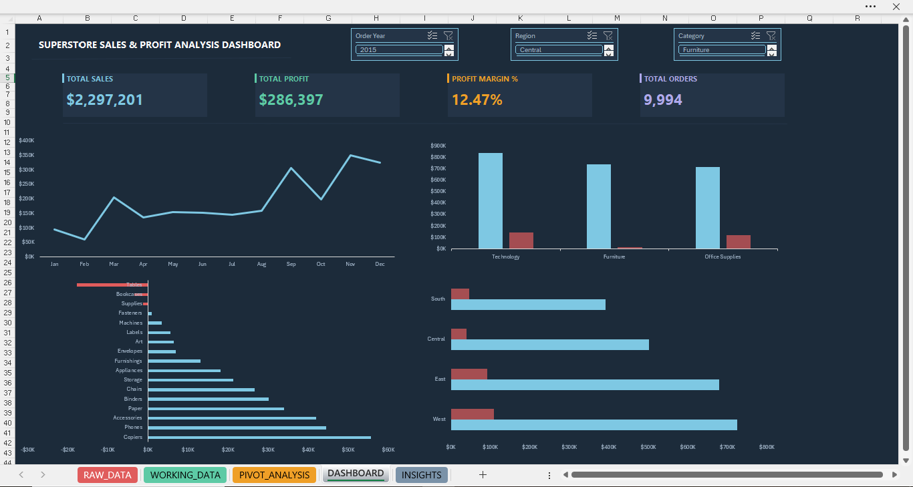
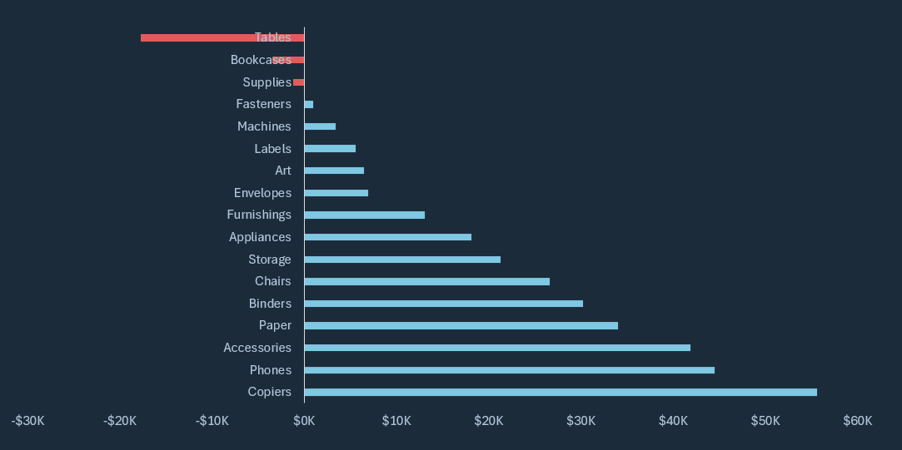

# Retail Sales & Profitability Analysis Dashboard

## Project Overview

Developed an interactive executive dashboard to analyze sales, profitability, regional performance, and product-level losses across 9,994 US retail transactions between 2014–2017 using Microsoft Excel. The project focused on identifying high-performing categories, loss-making products, regional trends, and seasonal sales patterns to support data-driven business decisions.

**Dataset:** [Kaggle — Superstore Dataset](https://www.kaggle.com/datasets/vivek468/superstore-dataset-final)  
**Tool:** Microsoft Excel  
**Analyst:** Jyoti Gupta

---

## Business Problem

The objective was to identify high-performing and loss-making product segments, evaluate regional profitability trends, and uncover seasonal sales patterns to support operational and pricing decisions.

---

## Executive Summary

The business generated $2.29M in sales with a 12.47% profit margin over four years. Technology emerged as the strongest-performing category, while Furniture suffered from persistent profitability issues driven by Tables and Bookcases. The West region consistently outperformed other markets, and Q4 contributed the highest concentration of annual revenue.

---

## Key Findings

| # | Finding | Data |
|---|---|---|
| 1 | Technology achieved the highest profitability among all categories | 17.4% profit margin |
| 2 | Furniture generated strong sales volume but weak profitability due to excessive discounting | Only 2.5% profit margin |
| 3 | Tables, Bookcases, and Supplies collectively generated significant losses | -$22,386 combined loss |
| 4 | West region outperformed all other regions in both sales and profitability | $725K sales, $108K profit |
| 5 | Q4 contributed the highest concentration of annual revenue, with November as the strongest month | ~40% annual revenue contribution |

---

## Dashboard Capabilities

- Executive KPI tracking for Sales, Profit, Margin, and Orders
- Monthly sales trend analysis across four years
- Product category and sub-category profitability analysis
- Regional sales performance comparison
- Interactive filtering using slicers for Year, Region, and Category

---

## Dashboard Preview

### Profit by Sub-Category Analysis

---

## Business Recommendations

- Cap Furniture discounts at 15% to improve profitability
- Prioritize Technology category investment due to highest ROI potential
- Review pricing and discount strategy for Tables and Bookcases
- Replicate high-performing West region sales strategies across weaker markets
- Increase Q4 inventory planning and forecasting from August onwards

---

## Project Outcome

This project demonstrates the ability to:
- analyze retail sales performance using Excel
- identify profitability risks and growth opportunities
- build executive dashboards with interactive filtering
- communicate business insights with actionable recommendations

---

## Files Included

| File | Description |
|---|---|
| `Superstore_Analysis.xlsx` | Main Excel dashboard workbook |
| `data/Sample_Superstore.csv` | Original raw dataset |
| `exports/dashboard.pdf` | Dashboard PDF export |
| `exports/insights_report.pdf` | Business insights PDF |
| `screenshots/` | Dashboard preview images |

---

## Skills Demonstrated

Excel · Pivot Tables · Pivot Charts · KPI Reporting · Dashboard Design · Data Visualization · Business Analysis · Executive Reporting

---

## Author

**Jyoti Gupta**  
Aspiring Data Analyst

- LinkedIn: https://www.linkedin.com/in/jyoti-gupta--/
- GitHub: https://github.com/jyotigupta17998
